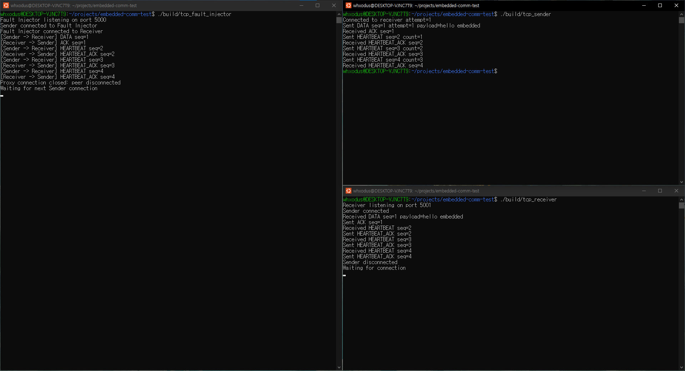
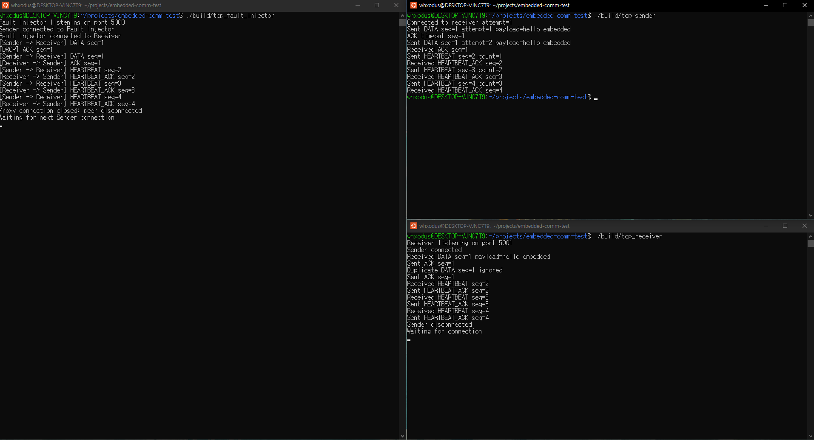
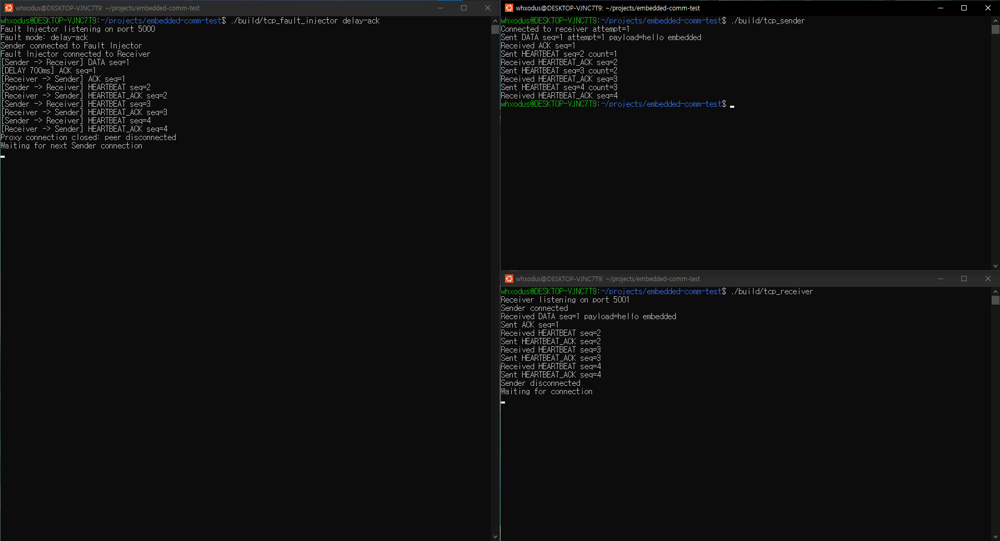
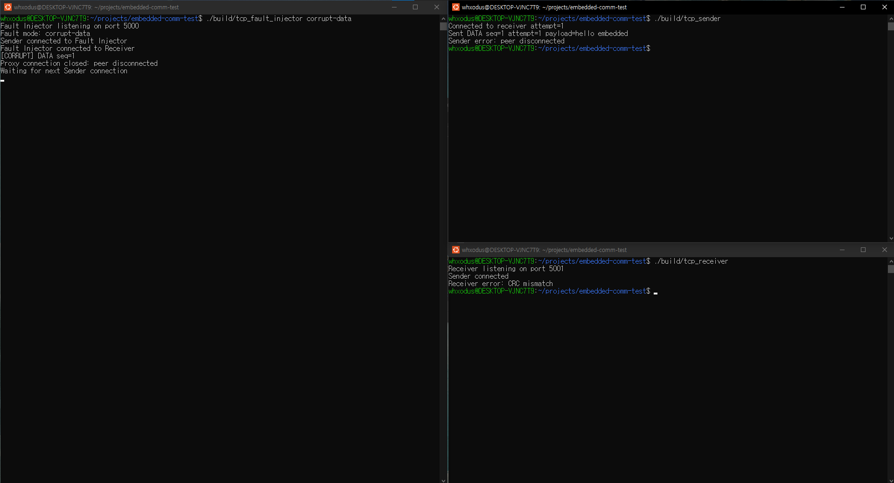
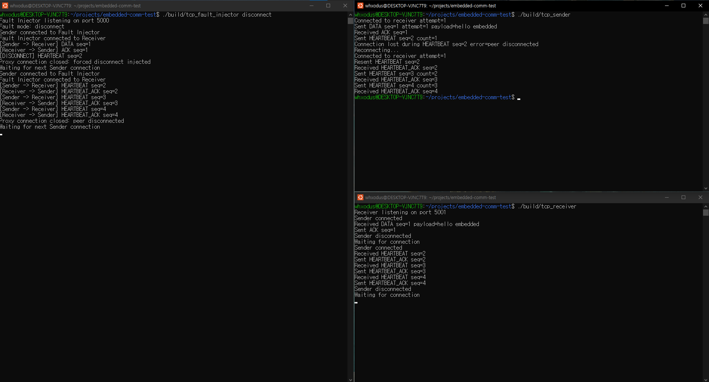
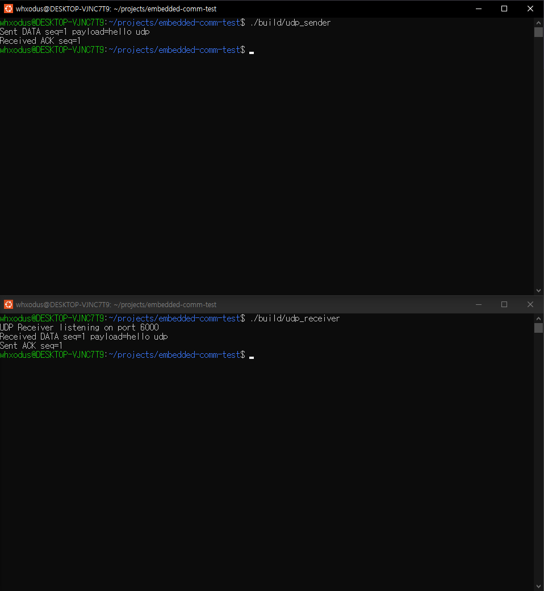
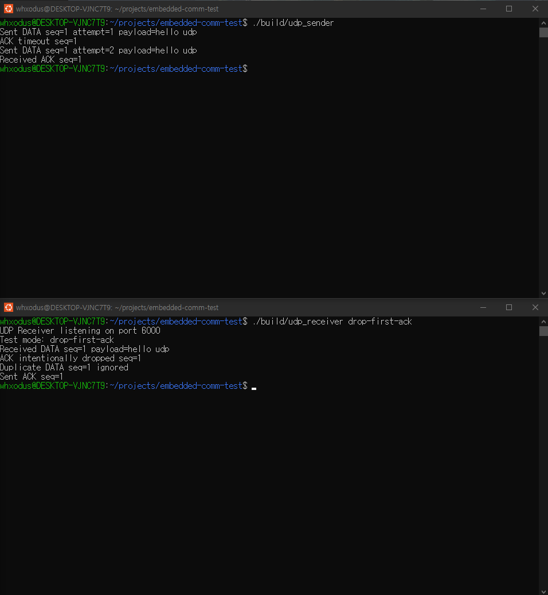
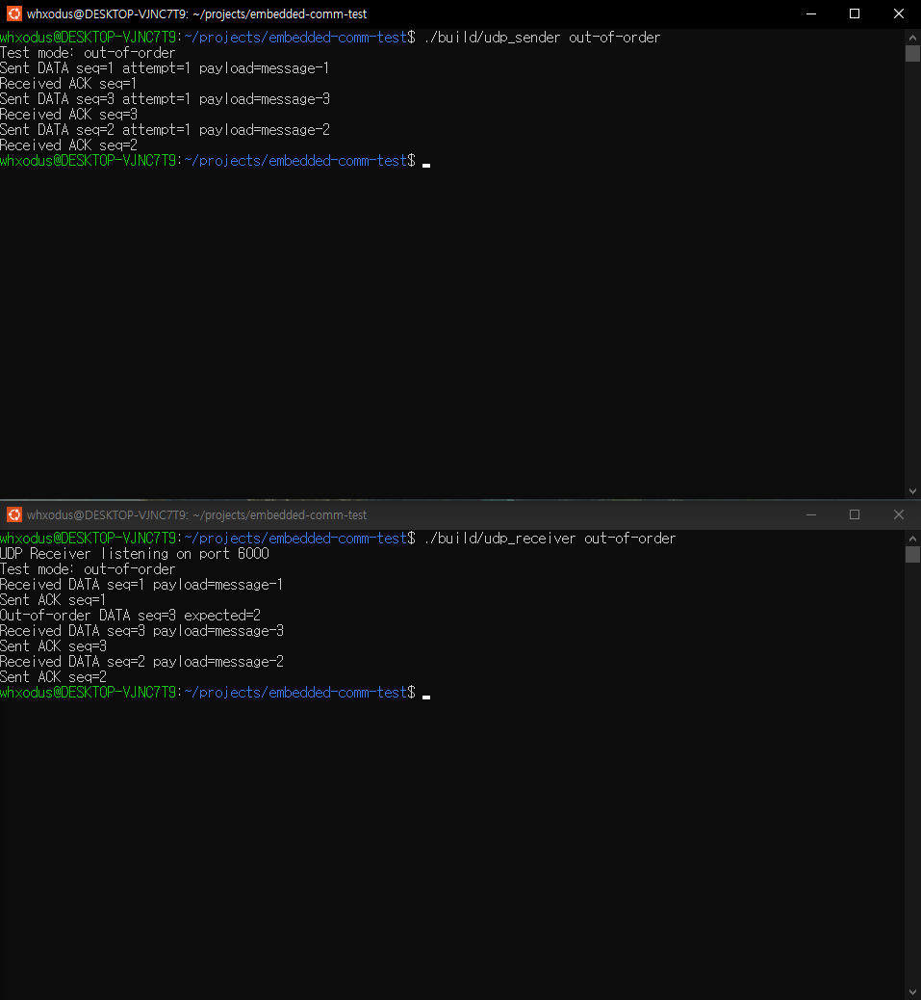

# Embedded Communication Reliability Testbed

C++로 Binary Application Protocol을 직접 설계하고, TCP와 UDP의 전송 특성 차이를 비교하며 ACK, Timeout, Retry, Duplicate Detection, Heartbeat, Reconnect, CRC 검증, Fault Injection, Out-of-order Detection을 구현하고 검증한 통신 신뢰성 테스트베드입니다.

단순 Socket 송수신 구현보다 다음 질문을 직접 구현하고 장애를 재현하면서 확인하는 것을 목표로 했습니다.

- TCP Byte Stream에서 Application Message 경계를 어떻게 복원할 것인가?
- TCP 자체의 신뢰성과 Application 수준의 처리 확인은 어떻게 다른가?
- ACK가 도착하지 않았을 때 언제, 어떻게 재전송할 것인가?
- Retry로 발생하는 중복 처리를 어떻게 방지할 것인가?
- 연결이 끊겼을 때 어떻게 감지하고 복구할 것인가?
- 전송 데이터가 손상되었을 때 어떻게 검출할 것인가?
- UDP에서는 어떤 신뢰성 기능을 Application이 직접 담당해야 하는가?
- UDP Datagram의 순서가 뒤바뀌었을 때 어떻게 감지할 것인가?
- 이러한 장애 상황을 어떻게 반복 가능하게 재현하고 검증할 것인가?

---

## Development Progress

| Phase | 내용 | 상태 |
|---|---|---|
| Phase 1 | TCP Communication & Binary Protocol | ✅ Complete |
| Phase 2 | Application Reliability | ✅ Complete |
| Phase 3 | Fault Injection | ✅ Complete |
| Phase 4 | UDP Reliability Extension | ✅ Complete |
| Final Validation | TCP / UDP Regression Test | ✅ PASS |

---

# Architecture

공통 Binary Protocol을 TCP와 UDP에서 재사용하고, Transport 특성에 따라 통신 처리만 분리했습니다.

```text
                         Binary Protocol
                              │
                 ┌────────────┴────────────┐
                 │                         │
                 ▼                         ▼

              TCP Path                  UDP Path

        ┌─────────────────┐        ┌─────────────────┐
        │   TCP Sender    │        │   UDP Sender    │
        └────────┬────────┘        └────────┬────────┘
                 │ :5000                    │
                 ▼                          │ Datagram
        ┌─────────────────┐                 ▼
        │ Fault Injector  │        ┌─────────────────┐
        │     :5000       │        │  UDP Receiver   │
        └────────┬────────┘        │     :6000       │
                 │                 └─────────────────┘
                 │ :5001
                 ▼
        ┌─────────────────┐
        │  TCP Receiver   │
        │     :5001       │
        └─────────────────┘
```

TCP Fault Injector는 두 개의 독립적인 TCP Connection 사이에서 동작합니다.

```text
TCP Sender ↔ Fault Injector
Fault Injector ↔ TCP Receiver
```

따라서 하나의 TCP Connection 내부에 Fault Injector가 삽입되는 구조가 아니라, Application Protocol Message를 해석하여 두 Connection 사이에서 Relay하는 Protocol-aware Proxy입니다.

---

# Binary Protocol

TCP와 UDP 모두 동일한 Binary Protocol을 사용합니다.

```text
Offset  Size  Field
0       2     Magic
2       1     Version
3       1     Type
4       4     Sequence
8       4     Payload Length
12      4     CRC32
16      N     Payload
```

Protocol 설정:

```text
Magic        = 0xAA55
Version      = 1
Header Size  = 16 bytes
Max Payload  = 1024 bytes
```

Message Type:

```text
Data         = 1
Ack          = 2
Heartbeat    = 3
HeartbeatAck = 4
```

Multi-byte Integer는 Network Byte Order로 변환합니다.

```text
htons / htonl
ntohs / ntohl
```

C/C++ 구조체 자체를 그대로 전송하지 않고 명시적인 Serialization / Deserialization을 사용하여 Padding, Alignment, Endianness에 의존하지 않도록 구현했습니다.

```text
Packet
   ↓
encode_packet()
   ↓
Binary Protocol
   ├─ TCP
   └─ UDP
```

---

# Phase 1 - TCP Communication & Binary Protocol

TCP는 Message 단위가 아니라 Byte Stream을 제공합니다.

Application에서 여러 번 `send()`를 호출하더라도 Receiver의 `recv()` 호출이 동일한 경계로 데이터를 반환한다는 보장이 없습니다.

```text
Sender

send(Packet A)
send(Packet B)

        ↓

TCP Byte Stream

AAAAAAAABBBBBBBB...
```

따라서 Header에 Payload Length를 포함하고 Receiver가 다음 순서로 Packet을 복원하도록 구현했습니다.

```text
16 Byte Header 수신
        ↓
Payload Length 확인
        ↓
Payload Length만큼 추가 수신
        ↓
Decode
        ↓
CRC 검증
```

이를 위해 `send_all()`과 `recv_exact()`을 사용하여 Partial Send / Receive를 처리했습니다.

---

## CRC32

데이터 손상을 검출하기 위해 CRC32를 추가했습니다.

CRC 입력:

```text
Magic
Version
Type
Sequence
Payload Length
Payload
```

CRC Field 자체는 계산에서 제외합니다.

사용한 CRC32 Polynomial:

```text
0xEDB88320
```

Packet Decode 시 수신된 CRC와 다시 계산한 CRC가 일치하지 않으면 오류로 처리합니다.

```text
CRC mismatch
```

Phase 1에서 구현한 핵심 항목:

- Binary Packet Format
- Serialization / Deserialization
- Network Byte Order
- TCP Byte Stream Framing
- Partial Send / Receive 처리
- CRC32
- DATA / ACK 통신

상세 내용은 [`docs/phase-1.md`](docs/phase-1.md)에 정리했습니다.

---

# Phase 2 - Application Reliability

TCP 자체에도 ACK와 Retransmission이 존재하지만 이는 TCP Byte Stream을 신뢰성 있게 전달하기 위한 Transport Layer 기능입니다.

이 프로젝트의 `MessageType::Ack`는 TCP ACK가 아니라 Receiver Application이 특정 Message를 수신하고 처리했다는 것을 확인하기 위한 Application Layer ACK입니다.

```text
Sender                              Receiver

DATA seq=1  ----------------------->

                          DATA 처리

            <----------------------- ACK seq=1
```

Sender는 Application ACK를 일정 시간 기다립니다.

```text
ACK Timeout = 1000 ms
Max Retry   = 3
```

초기 전송을 포함하여 최대 4번까지 전송할 수 있습니다.

```text
DATA seq=1 attempt=1
        ↓
ACK Timeout
        ↓
DATA seq=1 attempt=2
```

Retry에서도 동일한 논리 Message에는 동일한 Sequence를 유지합니다.

---

## Duplicate Detection

ACK가 손실되면 Receiver가 이미 처리한 DATA를 Sender가 다시 전송할 수 있습니다.

따라서 Receiver는 처리한 Sequence를 기록합니다.

```text
DATA seq=1
→ 처음 수신
→ 실제 처리
→ Sequence 저장

DATA seq=1
→ 이미 처리된 Sequence
→ Duplicate
→ 실제 처리 생략
→ ACK 재전송
```

이를 통해 Retry가 실제 Business Logic의 중복 실행으로 이어지는 것을 방지했습니다.

---

## Heartbeat

Application 수준에서 통신 상대의 응답 여부를 확인하기 위해 Heartbeat를 추가했습니다.

```text
HEARTBEAT seq=N
        ↓
HEARTBEAT_ACK seq=N
```

현재 설정:

```text
Heartbeat Interval = 2 sec
Heartbeat Timeout  = 1000 ms
Heartbeat Count    = 3
```

---

## Reconnect

Heartbeat 과정에서 Connection Loss를 감지하면 기존 Socket을 다시 사용하는 것이 아니라 새로운 TCP Connection을 생성합니다.

```text
Connection Lost
      ↓
Old Socket Close
      ↓
Reconnect
      ↓
Same HEARTBEAT Sequence Retry
      ↓
HEARTBEAT_ACK
```

상세 내용은 [`docs/phase-2.md`](docs/phase-2.md)에 정리했습니다.

---

# Phase 3 - Fault Injection

정상적인 localhost 통신만으로는 Timeout, Corruption, Disconnect 등의 Failure Path를 안정적으로 재현하기 어렵습니다.

따라서 Protocol-aware TCP Fault Injector를 추가했습니다.

```text
TCP Sender                Fault Injector                TCP Receiver

connect :5000  ------->   listen :5000
                               |
                               | connect
                               v
                          Receiver :5001
```

Fault Injector는 Binary Protocol을 Decode하여 Message Type과 Sequence를 확인한 뒤 선택적으로 장애를 주입합니다.

지원 Mode:

```text
none
drop-ack
delay-ack
corrupt-data
disconnect
```

---

## Transparent Proxy

Fault를 적용하지 않으면 모든 Message를 그대로 Relay합니다.

```text
Sender → DATA → Injector → DATA → Receiver
Sender ← ACK  ← Injector ← ACK  ← Receiver
```



---

## ACK Drop

Receiver는 ACK를 정상적으로 전송하지만 Fault Injector가 첫 번째 Application ACK를 다음 Connection으로 Relay하지 않습니다.

```text
Sender                  Injector                  Receiver

DATA seq=1  ---------->           -------------->

                                            ACK seq=1
                         <------------

                    X ACK Drop

ACK Timeout

DATA seq=1  ---------->           -------------->

                                      Duplicate

                         <------------ ACK seq=1
```

Sender:

```text
Sent DATA seq=1 attempt=1
ACK timeout seq=1
Sent DATA seq=1 attempt=2
Received ACK seq=1
```

Receiver:

```text
Received DATA seq=1
Duplicate DATA seq=1 ignored
```



---

## ACK Delay

첫 번째 ACK를 700ms 동안 지연했습니다.

```text
ACK Delay   = 700 ms
ACK Timeout = 1000 ms
```

Timeout보다 짧은 Delay를 사용하여 Retry와 섞이지 않는 순수한 Application Message Delay 상황을 검증했습니다.

```text
[DELAY 700ms] ACK seq=1
```

Sender에서는 Timeout 없이 ACK를 정상 수신했습니다.



---

## DATA Corruption

CRC 계산이 끝난 이후 실제 전송 Byte를 변경했습니다.

```text
Packet 생성
    ↓
encode_packet()
    ↓
CRC 계산 완료
    ↓
Payload Byte 변경
    ↓
Receiver
    ↓
CRC mismatch
```

Packet 자체를 수정한 뒤 다시 Encoding하면 변경된 Payload 기준으로 CRC가 다시 계산되므로 손상 상황을 재현할 수 없습니다.

따라서 Encoding 이후 첫 번째 Payload Byte를 변경했습니다.

Receiver:

```text
Receiver error: CRC mismatch
```



---

## Forced Disconnect

첫 번째 Heartbeat를 Receiver로 전달하기 전에 Fault Injector가 양쪽 TCP Connection을 종료합니다.

```text
HEARTBEAT seq=2
       ↓
Forced Disconnect
       ↓
Connection Lost
       ↓
Reconnect
       ↓
HEARTBEAT seq=2 Retry
       ↓
HEARTBEAT_ACK seq=2
```

Sender:

```text
Connection lost during HEARTBEAT seq=2
Reconnecting...
Connected to receiver attempt=1
Resent HEARTBEAT seq=2
Received HEARTBEAT_ACK seq=2
```

Reconnect 이후 seq=3, seq=4 Heartbeat도 정상적으로 처리되는 것을 확인했습니다.



상세 내용은 [`docs/phase-3.md`](docs/phase-3.md)에 정리했습니다.

---

# Phase 4 - UDP Reliability Extension

Phase 4에서는 동일한 Binary Protocol을 UDP에서도 사용하도록 확장했습니다.

TCP와 UDP의 중요한 차이 중 하나는 데이터 경계입니다.

TCP:

```text
Byte Stream

AAAAAAAABBBBBBBB...
```

UDP:

```text
[ Datagram A ]
[ Datagram B ]
```

UDP는 Datagram 경계를 유지하므로 TCP에서 사용했던 `recv_exact()` 기반 Message Framing이 필요하지 않습니다.

Receiver는 `recvfrom()` 한 번으로 Datagram 하나를 받은 뒤 Protocol Header에 기록된 Payload Length와 실제 Datagram 크기가 일치하는지 검증합니다.

기존 `encode_packet()`, `decode_packet()`, CRC32 로직은 그대로 재사용했습니다.

---

## UDP Basic Communication

UDP Receiver는 Port 6000을 사용합니다.

```text
UDP Sender
    │
    │ DATA Datagram
    ▼
UDP Receiver :6000
    │
    │ ACK Datagram
    ▼
UDP Sender
```

UDP에는 TCP와 같은 `listen()` / `accept()` 과정이 없습니다.

```text
TCP Receiver

socket()
→ bind()
→ listen()
→ accept()
→ recv()
```

```text
UDP Receiver

socket()
→ bind()
→ recvfrom()
```

기본 DATA / ACK 통신을 정상적으로 확인했습니다.



---

## UDP ACK Timeout / Retry

UDP는 Datagram 전달이나 자동 재전송을 보장하지 않습니다.

따라서 Application에서 직접 ACK를 기다리고 Timeout이 발생하면 동일한 Sequence를 재전송하도록 구현했습니다.

```text
DATA seq=1
    ↓
ACK 대기
    ↓
Timeout
    ↓
DATA seq=1 Retry
```

ACK Timeout:

```text
1000 ms
```

최대 Retry:

```text
3
```

---

## UDP Duplicate Detection

ACK Loss 상황을 재현하기 위해 Receiver에 다음 Test Mode를 추가했습니다.

```bash
./build/udp_receiver drop-first-ack
```

첫 번째 DATA는 정상 처리하지만 첫 ACK는 의도적으로 전송하지 않습니다.

Sender:

```text
Sent DATA seq=1 attempt=1 payload=hello udp
ACK timeout seq=1
Sent DATA seq=1 attempt=2 payload=hello udp
Received ACK seq=1
```

Receiver:

```text
Received DATA seq=1 payload=hello udp
ACK intentionally dropped seq=1
Duplicate DATA seq=1 ignored
Sent ACK seq=1
```

이를 통해 다음 흐름을 검증했습니다.

```text
ACK Loss
   ↓
Timeout
   ↓
Retry
   ↓
Duplicate Detection
   ↓
ACK 재전송
   ↓
Recovery
```



---

## UDP Out-of-order Detection

UDP는 Datagram 순서를 보장하지 않습니다.

localhost 환경에서 실제 Network Reordering 발생을 기다리는 방식은 재현성이 낮기 때문에 Sender가 의도적으로 다음 순서로 DATA를 전송하도록 했습니다.

```text
1 → 3 → 2
```

Receiver는 다음에 수신해야 할 Sequence를 추적합니다.

```text
expected_sequence = 1
```

`seq=1` 수신 이후에는:

```text
expected_sequence = 2
```

가 됩니다.

이때 `seq=3`이 먼저 도착하면:

```text
Out-of-order DATA seq=3 expected=2
```

로 감지합니다.

실제 결과:

```text
Received DATA seq=1 payload=message-1
Sent ACK seq=1

Out-of-order DATA seq=3 expected=2
Received DATA seq=3 payload=message-3
Sent ACK seq=3

Received DATA seq=2 payload=message-2
Sent ACK seq=2
```



이 테스트는 실제 네트워크에서 우연히 발생한 Reordering을 측정한 것이 아니라, UDP 환경에서 발생 가능한 순서 역전 상황을 통제된 입력으로 재현하여 Detection Logic을 검증한 것입니다.

별도의 Reordering Buffer나 Sliding Window는 구현하지 않았습니다.

상세 내용은 [`docs/phase-4.md`](docs/phase-4.md)에 정리했습니다.

---

# TCP vs UDP

| 항목 | TCP | UDP |
|---|---|---|
| Socket Type | `SOCK_STREAM` | `SOCK_DGRAM` |
| 통신 형태 | Connection-oriented | Connectionless |
| 데이터 형태 | Byte Stream | Datagram |
| Message 경계 | 보장하지 않음 | Datagram 경계 유지 |
| Server 처리 | `listen()` / `accept()` | 필요 없음 |
| 기본 송수신 | `send()` / `recv()` | `sendto()` / `recvfrom()` |
| Transport 전달 신뢰성 | 제공 | 제공하지 않음 |
| Transport 재전송 | 제공 | 제공하지 않음 |
| 순서 보장 | 제공 | 제공하지 않음 |
| TCP-style Reconnect | 필요 가능 | 해당 개념 없음 |
| Application ACK | 처리 확인 목적으로 사용 | 전달 / 처리 확인 목적으로 사용 |
| Application Retry | Application 수준 복구 | Datagram Loss 복구까지 직접 담당 |
| Duplicate Detection | Application Retry 때문에 필요 | Application Retry 때문에 필요 |
| Application Framing | 필요 | Datagram 경계 활용 |

TCP의 Transport ACK와 이 프로젝트의 Application ACK는 서로 다른 역할을 담당합니다.

```text
TCP ACK
→ TCP Stack이 Byte Stream 전달을 관리

Application ACK
→ 특정 Application Message의 수신 / 처리 여부 확인
```

UDP에는 TCP와 같은 Transport Retransmission이 없으므로 Application ACK / Timeout / Retry가 Datagram Loss에 대한 복구에도 직접 사용됩니다.

---

# Sequence Design

Sequence는 단순 Packet 번호 이상으로 여러 Reliability 기능에서 사용됩니다.

```text
Sequence
   ├─ ACK Matching
   ├─ Retry Identification
   ├─ Duplicate Detection
   └─ Out-of-order Detection
```

Retry에서는 동일한 논리 Message에 동일한 Sequence를 유지합니다.

```text
DATA seq=1 attempt=1
DATA seq=1 attempt=2
```

Receiver는 이 값을 이용해 두 Packet이 서로 다른 요청이 아니라 동일 요청의 재전송임을 판단합니다.

---

# Project Structure

```text
embedded-comm-test/
├── CMakeLists.txt
├── README.md
│
├── protocol/
│   ├── packet.hpp
│   ├── codec.hpp
│   ├── codec.cpp
│   ├── crc32.hpp
│   └── crc32.cpp
│
├── tcp/
│   ├── sender.cpp
│   └── receiver.cpp
│
├── udp/
│   ├── sender.cpp
│   └── receiver.cpp
│
├── fault_injector/
│   └── tcp_proxy.cpp
│
└── docs/
    ├── phase-1.md
    ├── phase-2.md
    ├── phase-3.md
    ├── phase-4.md
    │
    └── images/
        ├── phase-3-transparent-proxy.png
        ├── phase-3-ack-drop.png
        ├── phase-3-delay.png
        ├── phase-3-corruption.png
        ├── phase-3-disconnect.png
        ├── phase-4-udp-basic.png
        ├── phase-4-udp-retry.png
        └── phase-4-udp-out-of-order.png
```

---

# Build

Requirements:

- C++17
- CMake 3.16+
- Linux Socket API

Build:

```bash
cmake -S . -B build
cmake --build build
```

생성되는 실행 파일:

```text
build/tcp_sender
build/tcp_receiver
build/tcp_fault_injector
build/udp_sender
build/udp_receiver
```

---

# Run

## TCP Normal

Terminal 1:

```bash
./build/tcp_receiver
```

Terminal 2:

```bash
./build/tcp_fault_injector none
```

Terminal 3:

```bash
./build/tcp_sender
```

실행 순서:

```text
TCP Receiver
→ Fault Injector
→ TCP Sender
```

---

## TCP ACK Drop

```bash
./build/tcp_fault_injector drop-ack
```

---

## TCP ACK Delay

```bash
./build/tcp_fault_injector delay-ack
```

---

## TCP DATA Corruption

```bash
./build/tcp_fault_injector corrupt-data
```

---

## TCP Forced Disconnect

```bash
./build/tcp_fault_injector disconnect
```

Fault Mode는 프로세스 실행 중 한 번만 적용되므로 동일 Scenario를 다시 테스트하려면 Fault Injector를 재시작합니다.

---

## UDP Normal

Terminal 1:

```bash
./build/udp_receiver
```

Terminal 2:

```bash
./build/udp_sender
```

---

## UDP ACK Loss / Retry

Receiver:

```bash
./build/udp_receiver drop-first-ack
```

Sender:

```bash
./build/udp_sender
```

---

## UDP Out-of-order

Receiver:

```bash
./build/udp_receiver out-of-order
```

Sender:

```bash
./build/udp_sender out-of-order
```

---

# Final Validation

Phase 1~4 구현 완료 후 기존 Build 결과를 제거하고 Clean Build부터 전체 Regression Test를 다시 수행했습니다.

```bash
rm -rf build
cmake -S . -B build
cmake --build build
```

최종 검증 결과:

| Transport | Scenario | 검증 내용 | 결과 |
|---|---|---|---|
| Build | Clean Build | 전체 Target 재빌드 | PASS |
| TCP | Normal | DATA / ACK / Heartbeat | PASS |
| TCP | ACK Drop | ACK Timeout / Retry | PASS |
| TCP | Duplicate | 동일 Sequence 중복 처리 방지 | PASS |
| TCP | ACK Delay | Timeout 이전 ACK 수신 | PASS |
| TCP | Corruption | CRC32 손상 검출 | PASS |
| TCP | Disconnect | Connection Loss 감지 | PASS |
| TCP | Reconnect | 새로운 Connection 생성 후 Recovery | PASS |
| UDP | Normal | Datagram DATA / ACK | PASS |
| UDP | ACK Timeout | ACK Loss 감지 | PASS |
| UDP | Retry | 동일 Sequence 재전송 | PASS |
| UDP | Duplicate | 중복 DATA 처리 방지 | PASS |
| UDP | Recovery | Retry 이후 ACK 수신 | PASS |
| UDP | Out-of-order | Sequence 순서 이상 감지 | PASS |

최종 Repository 상태에서 모든 Scenario가 정상적으로 재현되는 것을 확인했습니다.

---

# Key Design Decisions

## 1. Protocol을 Transport와 분리

TCP와 UDP마다 별도의 Message Format을 만들지 않고 공통 `Packet`과 Codec을 사용했습니다.

이를 통해 Transport 특성에 따른 차이는 Socket 처리 영역에 두고 Protocol Format과 CRC 검증은 공유했습니다.

---

## 2. Application ACK를 별도로 구현

TCP가 제공하는 Transport Reliability와 Application Message 처리 확인은 서로 다른 문제로 보았습니다.

따라서 TCP에서도 별도의 Application ACK를 사용했습니다.

UDP에서는 동일한 구조가 Datagram Loss Recovery까지 담당합니다.

---

## 3. Retry와 Duplicate Detection을 함께 설계

Retry만 구현하면 ACK Loss 상황에서 동일 Message가 여러 번 처리될 수 있습니다.

따라서 동일 Sequence를 유지하는 Retry와 Receiver의 Duplicate Detection을 함께 구현했습니다.

---

## 4. 장애를 통제된 방식으로 재현

실제 네트워크 장애가 우연히 발생하기를 기다리지 않고 다음 Scenario를 직접 재현했습니다.

```text
ACK Drop
ACK Delay
DATA Corruption
Forced Disconnect
UDP ACK Loss
UDP Out-of-order
```

이를 통해 동일 Failure Path를 반복해서 검증할 수 있도록 했습니다.

---

## 5. Corruption은 Encoding 이후 적용

Packet 객체를 변경한 뒤 다시 Encode하면 새로운 Payload 기준으로 CRC도 함께 변경됩니다.

따라서 실제 Corruption을 재현하기 위해 CRC 계산이 끝난 Encoding 결과의 Payload Byte를 직접 변경했습니다.

---

## 6. 구현 범위를 의도적으로 제한

이 프로젝트의 목적은 범용 Networking Framework를 만드는 것이 아니라 TCP / UDP 통신과 Reliability Mechanism을 작은 구조에서 직접 구현하고 검증하는 것입니다.

따라서 다음 기능은 의도적으로 범위에서 제외했습니다.

```text
epoll
Multi-client Server
Thread Pool
TLS
MQTT
Protocol Buffers
Persistent Session ID
Sliding Window
Selective ACK
Out-of-order Reordering Buffer
Congestion Control
RTT-based Dynamic Timeout
Full Reliable UDP Protocol
```

---

# Limitations

현재 구현은 통신 신뢰성 메커니즘을 학습하고 검증하기 위한 Testbed입니다.

### Sequence Scope

TCP / UDP Receiver의 처리된 Sequence 정보는 Process Memory에만 존재합니다.

Receiver가 재시작되거나 새로운 논리 Session이 동일한 Sequence 공간을 다시 사용하는 경우까지 구분하려면 Session ID 또는 Persistent Sequence 관리가 추가로 필요합니다.

### TCP Fault Injector

Fault Injector는 단일 Thread 기반의 테스트용 Proxy입니다.

ACK Delay 과정에서는 Relay 자체가 해당 시간 동안 Block되므로 범용 Network Emulator가 아니라 통제된 Failure Scenario를 재현하기 위한 도구입니다.

### UDP Sender State

UDP Receiver는 단일 Sender를 기준으로 Sequence State를 관리합니다.

여러 Sender가 동일한 Receiver를 사용한다면 Sender Endpoint 또는 Session별로 Sequence State를 분리해야 합니다.

### Out-of-order Test

Out-of-order 검증은 실제 Network에서 우연히 발생한 Reordering을 측정한 것이 아닙니다.

Sender가 `1 → 3 → 2` 순서로 의도적으로 전송하여 Detection Logic을 반복 가능하게 검증했습니다.

---

# What I Learned

이 프로젝트를 통해 TCP와 UDP의 차이를 Socket API 수준이 아니라 Application Protocol 설계 관점에서 확인했습니다.

TCP에서는 신뢰성 있는 Byte Stream이 제공되지만 Message 경계가 존재하지 않기 때문에 Application에서 Framing을 직접 구현해야 했습니다.

또한 TCP의 ACK와 Retransmission이 존재하더라도 Receiver Application의 실제 Message 처리 여부까지 의미하는 것은 아니므로 Application ACK라는 별도의 개념이 필요할 수 있다는 점을 확인했습니다.

UDP에서는 반대로 Datagram 경계 덕분에 Framing은 단순해졌지만 전달, 재전송, 순서, 중복 제거가 보장되지 않으므로 필요한 Reliability Mechanism을 Application에서 직접 구현해야 했습니다.

ACK Loss를 재현하면서 Retry만으로는 충분하지 않고 Duplicate Detection이 함께 필요하다는 것을 확인했고, Sequence가 ACK Matching뿐 아니라 Retry Identification, Duplicate Detection, Out-of-order Detection을 연결하는 Protocol State로 활용될 수 있다는 것도 확인했습니다.

또한 정상 경로만 확인하는 것보다 장애를 통제된 방식으로 주입하고 Failure Path와 Recovery Path를 직접 검증하는 것이 통신 시스템을 이해하는 데 중요하다는 점을 경험했습니다.

최종적으로 다음 흐름을 하나의 프로젝트 안에서 구현하고 검증했습니다.

```text
Binary Protocol Design
        ↓
TCP Byte Stream Framing
        ↓
Application Reliability
        ↓
Fault Injection
        ↓
Failure / Recovery Validation
        ↓
UDP Reliability Extension
        ↓
TCP / UDP Comparison
        ↓
Final Regression Validation
```