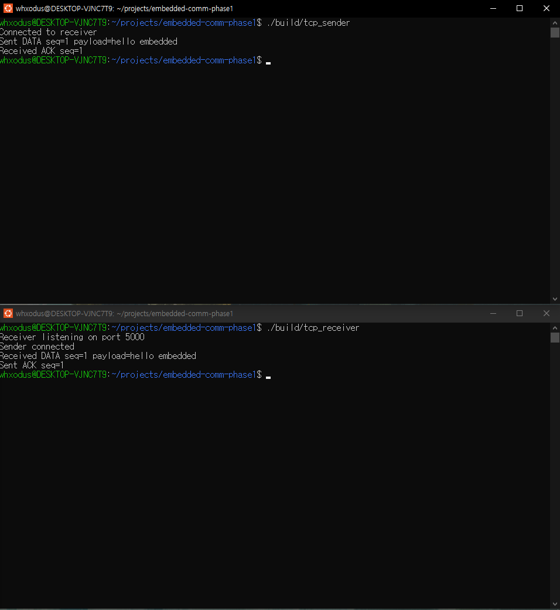
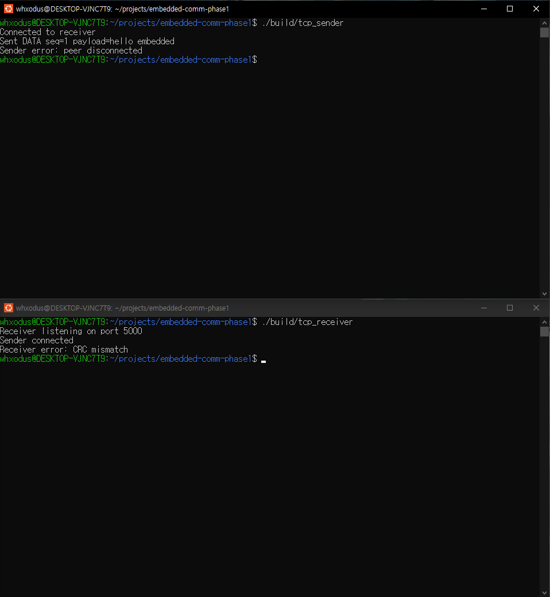
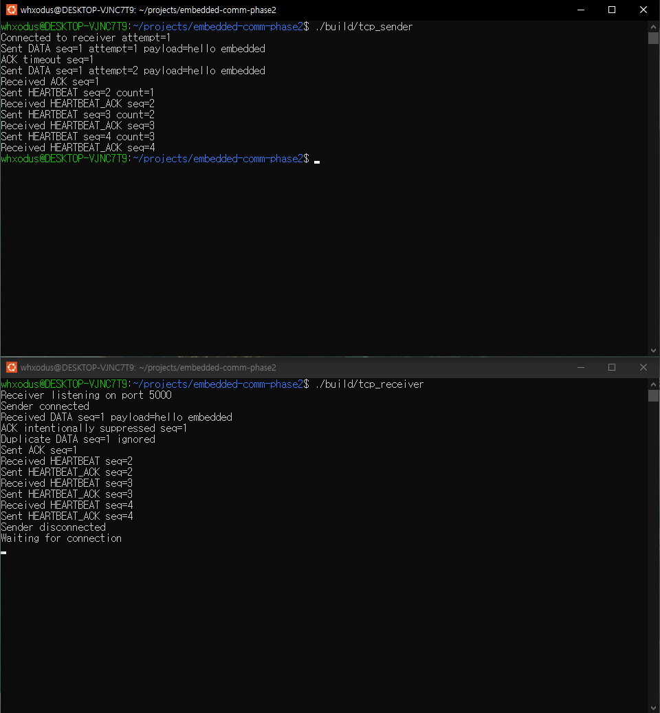
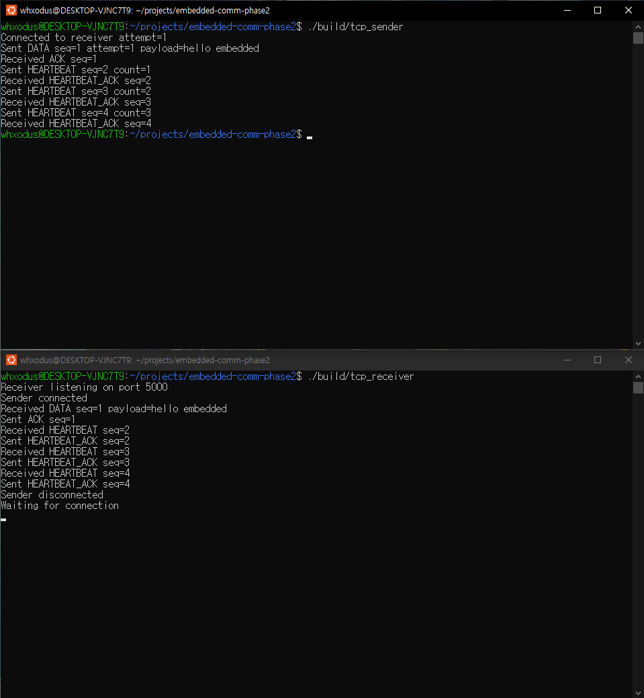
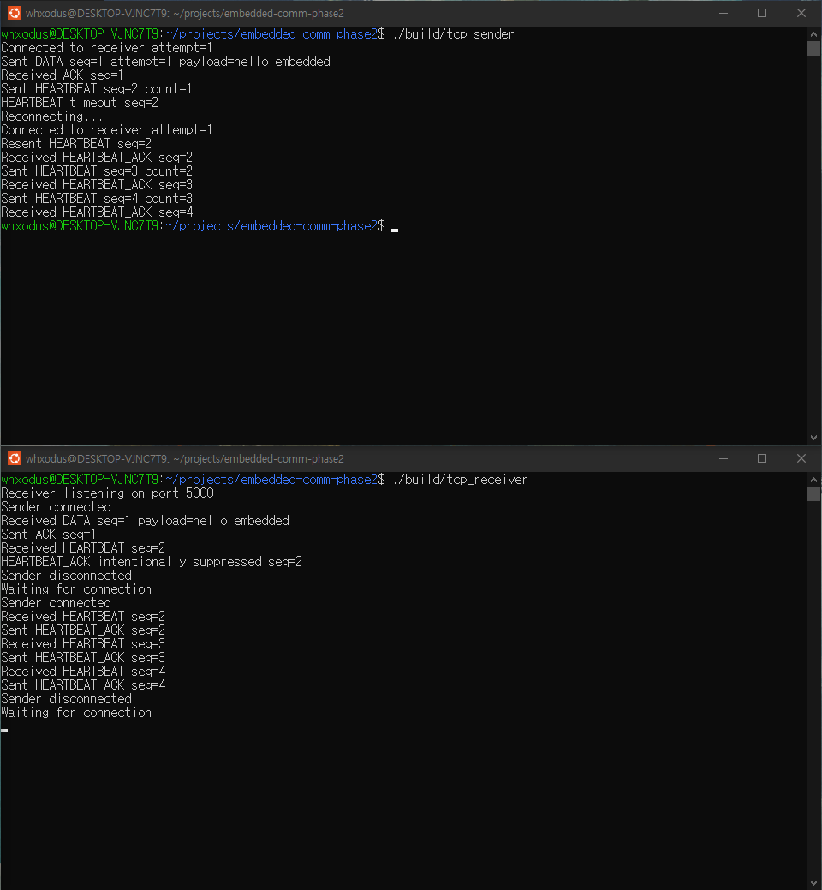

# Embedded Communication Reliability Testbed

C++ 기반 Binary Communication Protocol을 설계하고, TCP / UDP 환경에서 통신 장애와 Application-level Reliability를 구현·검증하기 위한 프로젝트이다.

단순 Socket 통신 구현에 그치지 않고 다음 질문을 단계적으로 확인하는 것을 목표로 한다.

```text
TCP Byte Stream에서 메시지 경계는 어떻게 구분하는가?

Binary Protocol의 Field를 어떻게 직렬화하고 해석하는가?

Application ACK와 TCP 내부 ACK의 역할은 어떻게 다른가?

응답이 오지 않을 때 Timeout과 Retry를 어떻게 처리하는가?

Retry로 동일 메시지가 다시 전달될 때 중복 처리는 어떻게 방지하는가?

통신이 없는 동안 상대 Application이 정상 동작 중인지 어떻게 확인하는가?

상대 Application이 응답하지 않을 경우 연결을 어떻게 판단하고 복구하는가?

UDP에서 신뢰성이 필요하다면 Application이 무엇을 구현해야 하는가?

통신 장애를 어떻게 의도적으로 재현하고 검증할 수 있는가?
```

---

## 프로젝트 목표

이 프로젝트의 핵심 목표는 TCP / UDP 자체를 다시 구현하는 것이 아니라, Transport Layer 위에서 Application이 요구하는 신뢰성 정책을 직접 구현하고 비교하는 것이다.

현재 TCP 경로에서는 다음 구조까지 구현했다.

```text
Application DATA
      ↓
Binary Protocol
      ↓
Serialization
      ↓
TCP Byte Stream
      ↓
Framing
      ↓
Deserialization / CRC Validation
      ↓
Application Processing
      ↓
ACK
      ↓
Timeout / Retry
      ↓
Duplicate Detection
```

통신 상태 확인 및 복구 경로:

```text
HEARTBEAT
      ↓
HEARTBEAT_ACK
      ↓
Timeout
      ↓
Disconnect 판단
      ↓
기존 Socket 종료
      ↓
Reconnect
      ↓
통신 상태 재확인
```

---

## 개발 단계

| Phase | 내용 | 상태 |
|---|---|---|
| Phase 1 | TCP Communication & Binary Protocol | ✅ |
| Phase 2 | Application Reliability | ✅ |
| Phase 3 | Fault Injection | 예정 |
| Phase 4 | UDP Reliability Extension | 예정 |
| Phase 5 | Test & Final Integration | 예정 |

---

## Phase 1 - TCP Communication & Binary Protocol

TCP Sender / Receiver를 구현하고 Binary Packet Format을 설계했다.

초기에는 다음과 같은 고정 길이 문자열 통신부터 시작했다.

```text
Sender
  ↓
"hello"
  ↓
Receiver
  ↓
"ack"
```

하지만 TCP는 Application Message Boundary를 제공하지 않는 Byte Stream이므로 Receiver가 실제 메시지의 끝을 알 수 없는 문제가 있다.

이를 해결하기 위해 Header에 Payload Length를 포함하는 Binary Protocol을 설계했다.

```text
[Magic][Version][Type][Sequence][Length][CRC32][Payload]
```

Receiver는 먼저 고정 크기 Header를 읽은 뒤 `Length`만큼 Payload를 추가로 수신한다.

```text
TCP Byte Stream
      ↓
Header 16 byte
      ↓
Payload Length 확인
      ↓
Payload 수신
```

또한 다음 기능을 구현했다.

- `send_all()`을 통한 Partial Send 처리
- `recv_exact()`을 통한 Partial Receive 처리
- Serialization / Deserialization
- Network Byte Order 변환
- Length 기반 TCP Framing
- CRC32 기반 Packet 검증
- Sequence 기반 DATA / ACK 대응

CRC 검증에서는 Encoding 이후 Payload 1 byte를 의도적으로 변경하여 Receiver가 `CRC mismatch`로 Packet을 거부하는 것을 확인했다.

상세 내용: `docs/phase-1.md`

---

## Phase 2 - Application Reliability

Phase 1의 Binary Protocol 위에 Application-level Reliability를 구현했다.

TCP 자체는 Byte Stream의 순서와 재전송을 관리하지만, Receiver Application이 실제 DATA를 처리했는지까지 의미하지는 않는다.

따라서 별도의 Application ACK를 사용한다.

```text
Sender
  │
  │ DATA seq=1
  ▼
Receiver Application
  │
  │ 처리 완료
  ▼
ACK seq=1
```

ACK가 일정 시간 동안 도착하지 않으면 Sender는 동일 Sequence의 DATA를 다시 전송한다.

```text
DATA seq=1
    ↓
ACK Timeout
    ↓
DATA seq=1 Retry
```

이번 Phase에서 사용한 정책:

```text
ACK Timeout : 1000 ms
Max Retry   : 3회
```

최초 전송을 포함하면 최대 4회 전송한다.

### Duplicate Detection

ACK가 전달되지 않았더라도 Receiver가 DATA를 이미 처리했을 수 있다.

이 상태에서 Sender가 동일 DATA를 Retry하면 동일 작업이 다시 실행될 수 있다.

Receiver는 처리한 Sequence를 저장하여 동일 Sequence가 다시 들어온 경우 재처리하지 않는다.

```text
DATA seq=1
    ↓
처리 완료
    ↓
ACK 유실

DATA seq=1 Retry
    ↓
Duplicate Detection
    ↓
실제 처리 X
    ↓
ACK만 재전송
```

현재는 `std::unordered_set<uint32_t>`를 사용하여 처리된 Sequence를 관리한다.

### Application Heartbeat

DATA 통신이 없는 동안에도 상대 Application이 실제로 응답 가능한 상태인지 확인하기 위해 Heartbeat를 추가했다.

```text
HEARTBEAT seq=N
        ↓
Receiver Application
        ↓
HEARTBEAT_ACK seq=N
```

`ACK`와 `HEARTBEAT_ACK`의 의미는 구분된다.

```text
ACK
= DATA가 Application에서 처리되었음을 확인

HEARTBEAT_ACK
= 상대 Application이 현재 응답 가능한 상태임을 확인
```

Heartbeat 정책:

```text
Heartbeat Interval : 2 sec
Heartbeat Timeout  : 1 sec
Heartbeat Count    : 3
```

### Reconnect

Heartbeat 응답이 제한 시간 안에 도착하지 않으면 기존 TCP Connection을 신뢰하지 않고 종료한다.

```text
HEARTBEAT
    ↓
Timeout
    ↓
close(old socket)
    ↓
connect()
    ↓
New TCP Connection
```

Reconnect 이후에는 실패했던 동일 Heartbeat를 다시 전송하여 새로운 Connection에서 통신 상태를 확인한다.

```text
HEARTBEAT seq=2
    ↓
Timeout
    ↓
Reconnect
    ↓
HEARTBEAT seq=2 재전송
    ↓
HEARTBEAT_ACK seq=2
```

Reconnect 정책:

```text
Reconnect Delay        : 2 sec
Max Reconnect Attempts : 3
```

Receiver는 Listening Socket을 유지하면서 Sender의 새로운 Connection을 계속 받을 수 있도록 `accept()` 루프 구조로 확장했다.

상세 내용: `docs/phase-2.md`

---

## 전체 시스템 구조

현재 TCP 경로의 구조는 다음과 같다.

```text
TCP Sender
    │
    │ Packet
    ▼
encode_packet()
    │
    │ Binary Buffer
    ▼
send_all()
    │
    ▼
Linux TCP Stack
    │
    ▼
127.0.0.1:5000
    │
    ▼
Linux TCP Stack
    │
    ▼
recv_exact()
    │
    ▼
TCP Receiver
    │
    ├── Header 수신
    ├── Payload Length 확인
    ├── Payload 수신
    ├── decode_packet()
    ├── CRC Validation
    ├── Duplicate Detection
    └── Application Processing
```

Application Reliability 흐름:

```text
DATA
  ↓
ACK
  │
  └─ 응답 없음
       ↓
     Timeout
       ↓
     Retry
       ↓
Duplicate Detection
```

Liveness 및 Recovery 흐름:

```text
HEARTBEAT
    ↓
HEARTBEAT_ACK
    │
    └─ 응답 없음
         ↓
       Timeout
         ↓
       Disconnect
         ↓
       Reconnect
```

---

## Protocol Format

Binary Protocol의 Wire Format은 다음과 같다.

| Offset | Size | Field |
|---:|---:|---|
| 0 | 2 byte | Magic |
| 2 | 1 byte | Version |
| 3 | 1 byte | Type |
| 4 | 4 byte | Sequence |
| 8 | 4 byte | Payload Length |
| 12 | 4 byte | CRC32 |
| 16 | N byte | Payload |

Header Size:

```text
16 bytes
```

기본 Protocol 값:

```text
Magic       : 0xAA55
Version     : 1
Max Payload : 1024 bytes
```

Message Type:

```text
DATA          = 1
ACK           = 2
HEARTBEAT     = 3
HEARTBEAT_ACK = 4
```

---

## Repository Structure

```text
embedded-comm-test/
├── README.md
├── CMakeLists.txt
├── docs/
│   ├── phase-1.md
│   ├── phase-2.md
│   └── images/
│       ├── phase-1-tcp-basic.png
│       ├── phase-1-crc-corruption.png
│       ├── phase-2-heartbeat.png
│       ├── phase-2-retry-duplicate.png
│       └── phase-2-reconnect.png
├── protocol/
│   ├── packet.hpp
│   ├── codec.hpp
│   ├── codec.cpp
│   ├── crc32.hpp
│   └── crc32.cpp
└── tcp/
    ├── sender.cpp
    └── receiver.cpp
```

향후 Phase 진행에 따라 다음 디렉터리를 추가할 예정이다.

```text
fault_injector/
udp/
tests/
```

---

## Build

```bash
cmake -S . -B build
cmake --build build
```

생성되는 주요 실행파일:

```text
build/tcp_sender
build/tcp_receiver
```

---

## Run

Receiver를 먼저 실행한다.

```bash
./build/tcp_receiver
```

다른 Terminal에서 Sender를 실행한다.

```bash
./build/tcp_sender
```

---

## 정상 실행 예시

Sender:

```text
Connected to receiver attempt=1
Sent DATA seq=1 attempt=1 payload=hello embedded
Received ACK seq=1
Sent HEARTBEAT seq=2 count=1
Received HEARTBEAT_ACK seq=2
Sent HEARTBEAT seq=3 count=2
Received HEARTBEAT_ACK seq=3
Sent HEARTBEAT seq=4 count=3
Received HEARTBEAT_ACK seq=4
```

Receiver:

```text
Receiver listening on port 5000
Sender connected
Received DATA seq=1 payload=hello embedded
Sent ACK seq=1
Received HEARTBEAT seq=2
Sent HEARTBEAT_ACK seq=2
Received HEARTBEAT seq=3
Sent HEARTBEAT_ACK seq=3
Received HEARTBEAT seq=4
Sent HEARTBEAT_ACK seq=4
Sender disconnected
Waiting for connection
```

Receiver는 하나의 Sender가 종료된 이후에도 Listening Socket을 유지하고 다음 Connection을 기다린다.

---

## 실행 증거

### Phase 1 - TCP Binary Protocol

정상 DATA / ACK 통신을 통해 Binary Protocol Encoding / Decoding, TCP Framing과 Sequence 기반 ACK가 정상적으로 동작하는 것을 확인했다.



Encoding 이후 Payload Byte를 의도적으로 변경하여 Receiver가 손상된 Packet을 `CRC mismatch`로 거부하는 것을 확인했다.



### Phase 2 - ACK Timeout / Retry / Duplicate Detection

첫 Application ACK를 의도적으로 누락했다.

Sender는 1초 후 ACK Timeout을 감지하고 동일한 `seq=1` DATA를 재전송했다.

Receiver는 Retry된 DATA를 Duplicate로 판단하여 실제 처리를 반복하지 않고 ACK만 다시 반환했다.

```text
ACK Loss
    ↓
ACK Timeout
    ↓
DATA seq=1 Retry
    ↓
Duplicate Detection
    ↓
ACK
```



### Phase 2 - Normal Heartbeat

정상 상태에서는 `HEARTBEAT seq=2,3,4`와 각각의 `HEARTBEAT_ACK`가 정상적으로 교환되는 것을 확인했다.



### Phase 2 - Heartbeat Timeout / Reconnect

첫 `HEARTBEAT_ACK`를 의도적으로 누락해 Heartbeat Timeout을 발생시켰다.

Sender는 기존 Connection을 종료한 뒤 새로운 TCP Connection을 생성하고 실패했던 동일 `HEARTBEAT seq=2`를 다시 전송했다.

```text
HEARTBEAT seq=2
    ↓
HEARTBEAT_ACK 없음
    ↓
Timeout
    ↓
Old Connection Close
    ↓
Reconnect
    ↓
HEARTBEAT seq=2 Retry
    ↓
HEARTBEAT_ACK
```

Reconnect 이후 `seq=3`, `seq=4`도 정상적으로 처리되는 것을 확인했다.



---

## 검증 결과

### Phase 1

| Scenario | 결과 | 판정 |
|---|---|---|
| Normal DATA / ACK | Binary Packet 정상 송수신 | PASS |
| TCP Framing | Header Length 기반 Payload 수신 | PASS |
| CRC Corruption | 손상된 Payload 검출 및 거부 | PASS |
| Normal Regression | 장애 코드 제거 후 정상 동작 재확인 | PASS |

### Phase 2

| Scenario | 결과 | 판정 |
|---|---|---|
| Normal DATA / ACK | 최초 전송에서 ACK 수신 | PASS |
| ACK Timeout | 1초 후 Timeout 검출 | PASS |
| Retry | 동일 Sequence로 DATA 재전송 | PASS |
| Duplicate DATA | 재처리하지 않고 ACK만 반환 | PASS |
| Normal Heartbeat | HEARTBEAT / HEARTBEAT_ACK 정상 교환 | PASS |
| Heartbeat Timeout | 응답 없음 검출 | PASS |
| Disconnect | 기존 Connection 종료 | PASS |
| Reconnect | 새로운 TCP Connection 생성 | PASS |
| Recovery | Reconnect 이후 통신 정상 복구 | PASS |
| Normal Regression | 테스트 장애 코드 제거 후 정상 동작 | PASS |

---

## 구현을 통해 확인한 내용

현재까지 다음 요소를 직접 구현하고 연결했다.

```text
Linux Socket API
TCP Client / Server
socket / bind / listen / accept / connect
send / recv
poll
Partial Send / Receive Handling
Binary Protocol Design
Serialization / Deserialization
Network Byte Order
Length-based Framing
CRC32 Validation
Sequence Number
Application ACK
Timeout
Retry
Duplicate Detection
Heartbeat
Application-level Liveness Check
Disconnect Detection
Reconnect
```

Phase 1에서는 TCP Byte Stream 위에서 Application Message를 어떻게 구성할 것인지에 집중했다.

```text
Byte Stream
    ↓
Framing
    ↓
Binary Protocol
```

Phase 2에서는 정상 통신 이후 발생할 수 있는 장애 상황에서 Application이 어떤 정책을 가져야 하는지 구현했다.

```text
ACK 없음
→ Timeout
→ Retry
→ Duplicate Detection

Heartbeat 응답 없음
→ Connection 이상 판단
→ Disconnect
→ Reconnect
```

---

## 현재 구현 범위

현재 `processed_sequences`는 Receiver Process Memory에 저장한다.

따라서 Receiver Process가 재시작되면 중복 처리 이력은 사라진다.

또한 Receiver를 계속 실행한 상태에서 새로운 논리 Session이 Sequence를 다시 `1`부터 사용할 경우 기존 처리 기록과 충돌할 수 있다.

이를 확장하려면 다음과 같은 설계가 필요할 수 있다.

```text
Session ID
Persistent Deduplication State
Sequence Scope 관리
```

하지만 현재 프로젝트에서는 하나의 논리 통신 Session 내에서 발생하는 Timeout, Retry, Duplicate Delivery, Heartbeat Timeout 및 Reconnect 동작을 구현하고 검증하는 데 범위를 제한한다.

---

## Next Phase

Phase 3에서는 Sender와 Receiver 사이에 별도의 Fault Injector를 추가한다.

```text
Sender
   │
   ▼
Fault Injector
   │
   ├── Message Drop
   ├── Delay
   ├── Corruption
   └── Disconnect
   │
   ▼
Receiver
```

지금까지 Receiver 코드를 직접 수정하여 재현했던 장애를 독립된 중간 Proxy에서 주입하도록 변경한다.

이를 통해 정상 Application Code를 변경하지 않고도 통신 장애와 복구 동작을 반복적으로 검증할 수 있도록 확장한다.