# AI-Assisted Reliability Verification

기존 Phase 1~4는 사람이 설계한 대표 장애를 검증했다. 이 단계는 source / protocol / coverage 분석으로 가설을 만들고, **AI의 답을 결론으로 사용하지 않고** controlled reproduction과 관측 가능한 조건으로 검증한 후 원인을 수정한 기록이다.

[AI Workflow — 입력, 역할 분리, 채택하지 않은 결함 후보](ai-workflow.md)

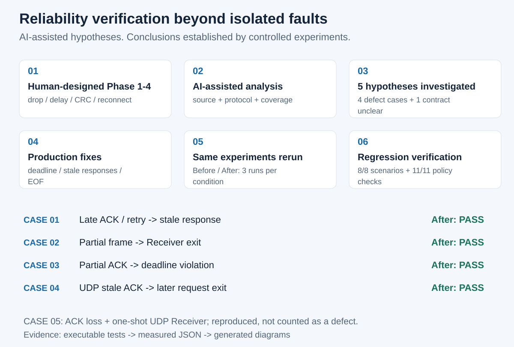

## Evidence and scope

- Baseline: `v1.0.0`, commit `9a9eb646e63084e7e1cb60813fad249fe319b77f`.
- Before는 이전 대화나 임시 로그에서 복사하지 않고 이 runner로 새로 3회씩 실행했다.
- Main defect: CASE 01~04. CASE 05는 현상 재현과 별개로 계약 불명확으로 제외했다.
- 실제 production binaries를 사용한다. CASE 03의 TCP peer와 UDP relay는 fault input을 제어한다.
- CASE 01은 외부 build copy에서 Proxy의 ACK delay 한 줄만 700→1200ms로 변경한다. 원본 default는 700ms다.
- UDP relay는 6000번, 외부 Receiver copy는 6001번을 사용한다. copy의 변경은 listen port 한 줄뿐이며 protocol/timeout/retry/lifecycle은 동일하다.
- 결과는 로컬 Linux/WSL의 통제된 실행이다. 운영 성능·인터넷 발생 빈도·완전한 프로토콜 검증을 주장하지 않는다.

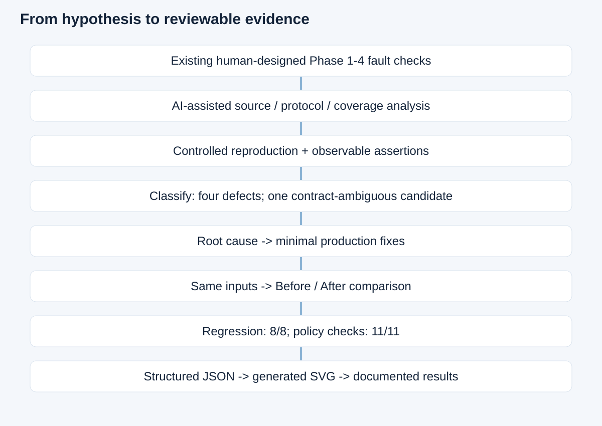

## Before / Fix / After

<!-- evidence-matrix:start -->
| Case | Before | Root cause / fix | After |
|---|---|---|---|
| 01 Late ACK | Heartbeat failure 3/3 | Completed-response matching; one absolute deadline | Exit 0 + Heartbeat 2/3/4 3/3 |
| 02 Partial frame | Partial EOF receiver exits: 6; zero-byte EOF controls survive | EOF stays connection-local; discard incomplete frame | Follow-up DATA/ACK 12/12 |
| 03 Partial ACK | 3208.467, 3208.279, 3202.405 ms ACK success | Deadline-aware receive; partial connection discarded | 1001.439, 1001.531, 1001.675 ms explicit failure |
| 04 UDP stale ACK | ACK mismatch / exit 1 3/3 | Completed-sequence history; fixed deadline | ACK 1/3/2 + exit 0 3/3 |
<!-- evidence-matrix:end -->

CASE 02의 12개 관측은 네 EOF 경계 × 3회다. 기존 실패는 partial header 3회와 partial payload 3회이며, 나머지 여섯 개는 생존 대조 조건이다. CASE 03은 두 조건 × 3회다. 따라서 main defect 수를 실행 횟수와 혼동하지 않는다.

## Reproduce

Linux, C++17 compiler, CMake 3.16+, Python 3 standard library, `stdbuf`가 필요하다. 외부 Python dependency는 없다. 고정 포트 TCP 5000/5001 및 UDP 6000/6001을 사용하는 runner는 **동시에 실행하지 않는다**. 자신이 시작한 process만 종료하며 다른 listener를 제거하지 않는다. 출력 원본은 실행 시 표시되는 임시 디렉터리에 남는다.

현재 source의 After 전체 실행:

```bash
python3 reliability_verification/common/runner.py --phase after --case all --repeat 3
python3 reliability_verification/common/runner.py --phase after --case regression
python3 reliability_verification/common/guards.py
python3 reliability_verification/common/candidate05.py
```

각 case 독립 실행:

```bash
python3 reliability_verification/case-01-late-ack/reproduce.py --phase after --repeat 3
python3 reliability_verification/case-02-partial-frame/reproduce.py --phase after --repeat 3
python3 reliability_verification/case-03-partial-ack-deadline/reproduce.py --phase after --repeat 3
python3 reliability_verification/case-04-udp-stale-ack/reproduce.py --phase after --repeat 3
```

태그를 변경하거나 현재 source를 되돌리지 않고 Before를 다시 실행:

```bash
baseline=$(mktemp -d)
git archive v1.0.0 | tar -x -C "$baseline"
python3 reliability_verification/common/runner.py --phase before --case all   --repeat 3 --source "$baseline" --output "$baseline/rechecked-evidence"
```

`--phase before`만 현재 수정된 source에 적용하면 Before 기대 조건이 성립하지 않으므로 실패하는 것이 정상이다. 보존된 결과를 덮어쓰지 않는 재검증에는 `--output`을 사용한다. 원본 결과 JSON에는 source SHA256와 실행 당시 harness SHA256를 기록했다. working-tree source identity는 commit 이름보다 이 해시가 정확하다.

## Assertions and timing

Process exit, peer에서 관측한 packet/sequence, 실제 ACK, duplicate 횟수, EOF 후 같은 sequence의 새 DATA 처리, elapsed time을 조합한다. 로그 문자열 하나나 PID 생존 하나만으로 통과시키지 않는다. `matched_expected_behavior`는 Before에서는 관측된 결함/대조 조건이 일치한다는 뜻이고, After에서는 요구 invariant를 만족한다는 뜻이다.

CASE 03의 deadline은 1000ms이며 관찰 허용 범위는 900~1250ms다. 로그 수집과 scheduler 지연을 수용하되 3200ms 지연을 통과시키지 않는다. 이 범위를 벗어나면 test failure로 남기며 임의로 허용 폭을 넓히지 않는다. timestamp는 monotonic clock으로 기록한 peer 동작/로그 수집 시각이다. process 간 미세한 로그 순서는 packet capture로 증명한 순서가 아니다.

## CASE 01 — Late ACK / retry

[Detailed investigation](case-01-late-ack/README.md)

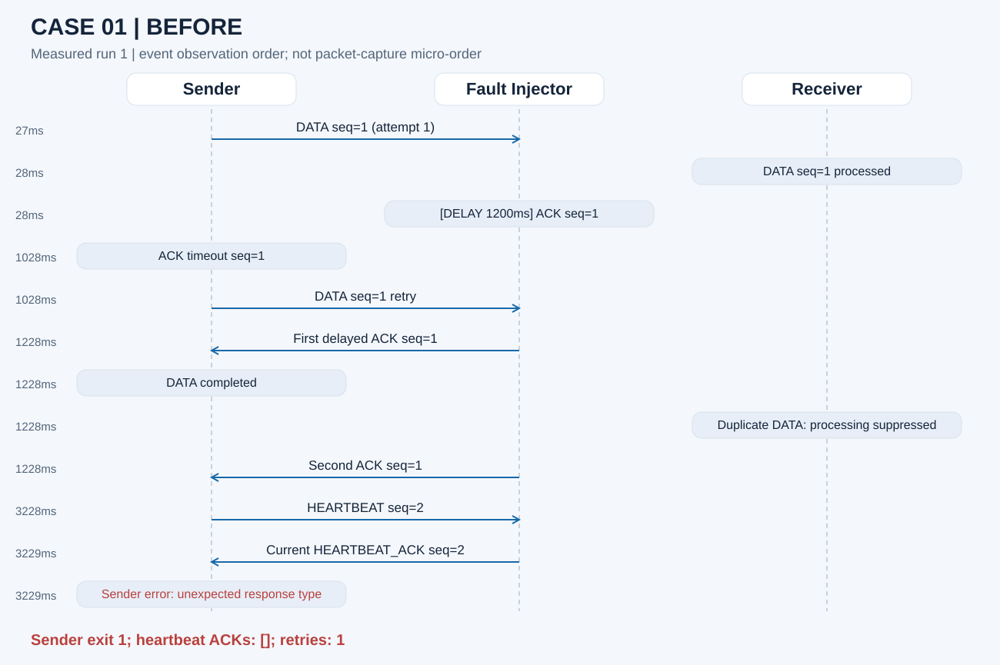

DATA가 완료된 뒤 남은 ACK를 Heartbeat 응답으로 해석해 종료했다. 수정 후에는 실제 완료된 `(type, sequence)` 응답만 stale로 소비하며 같은 absolute deadline으로 현재 응답을 기다린다.

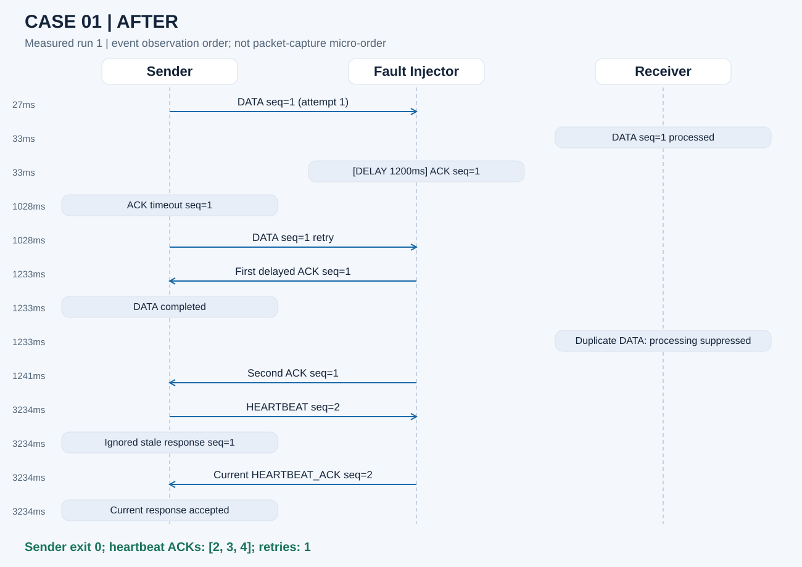
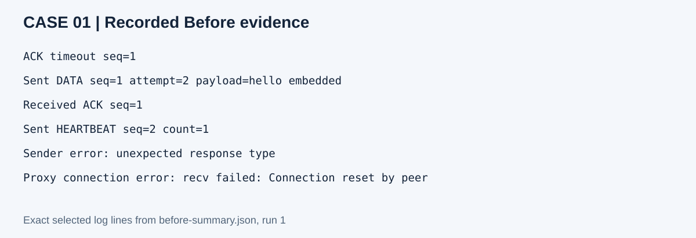

## CASE 02 — Partial frame EOF

[Detailed investigation](case-02-partial-frame/README.md)

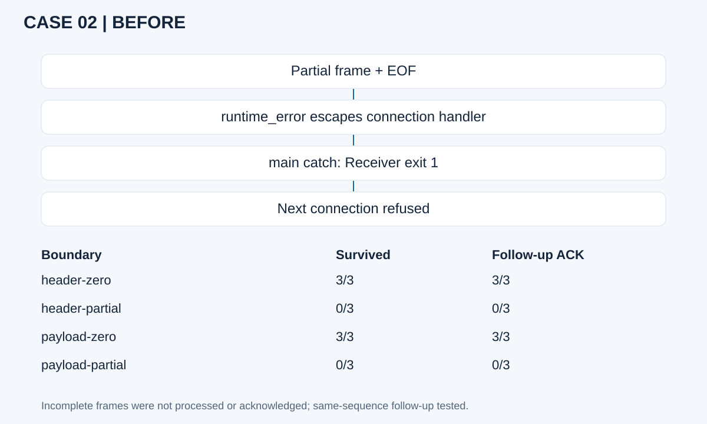

EOF는 수신량과 무관하게 연결 종료로 분류한다. 완전한 packet decode 전에 예외가 발생하므로 incomplete DATA 처리/ACK는 없다. listener는 유지하며 후속 connection에서 **동일 sequence** DATA를 새로 처리하는지 검증했다.

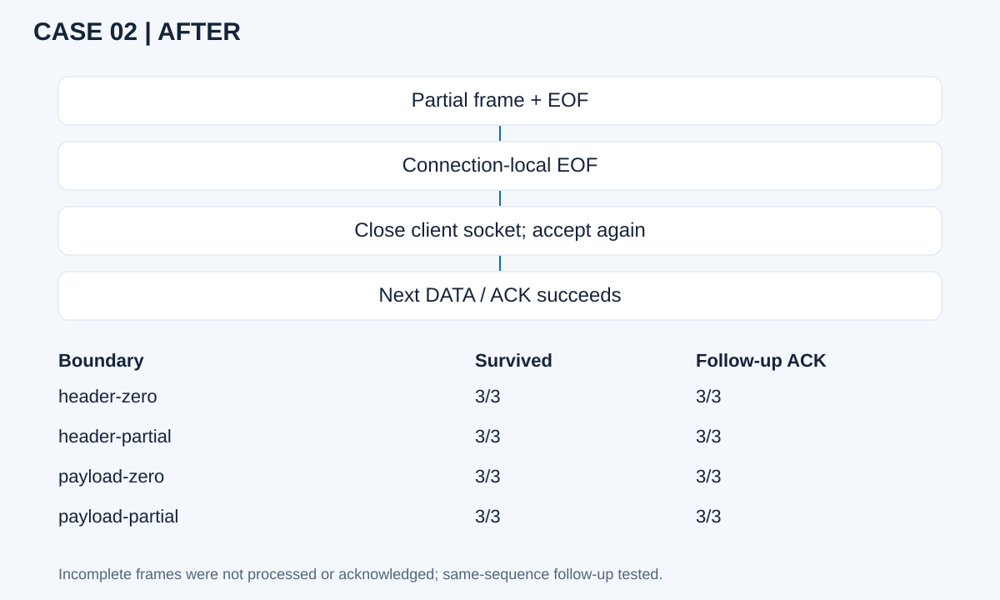
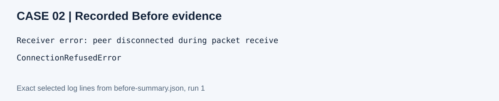

## CASE 03 — Full response deadline

[Detailed investigation](case-03-partial-ack-deadline/README.md)

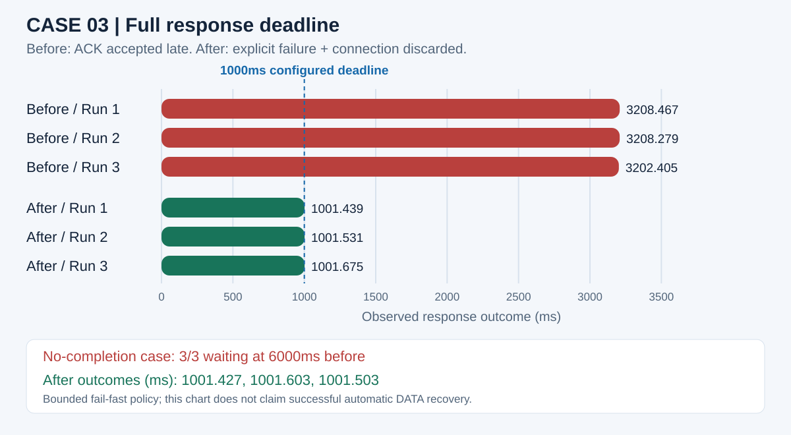

After의 약 1초 outcome은 ACK 성공 시간이 아니라 **명시적 실패 시각**이다. 부분 frame에서 deadline이 끝나면 해당 socket을 shutdown/close하고 Sender를 exit 1로 종료한다. 자동 DATA reconnect는 추가하지 않았다. frame 경계에서 아무 바이트도 읽지 못한 timeout은 기존 DATA retry / Heartbeat reconnect 정책을 유지한다.

## CASE 04 — UDP stale ACK

[Detailed investigation](case-04-udp-stale-ack/README.md)

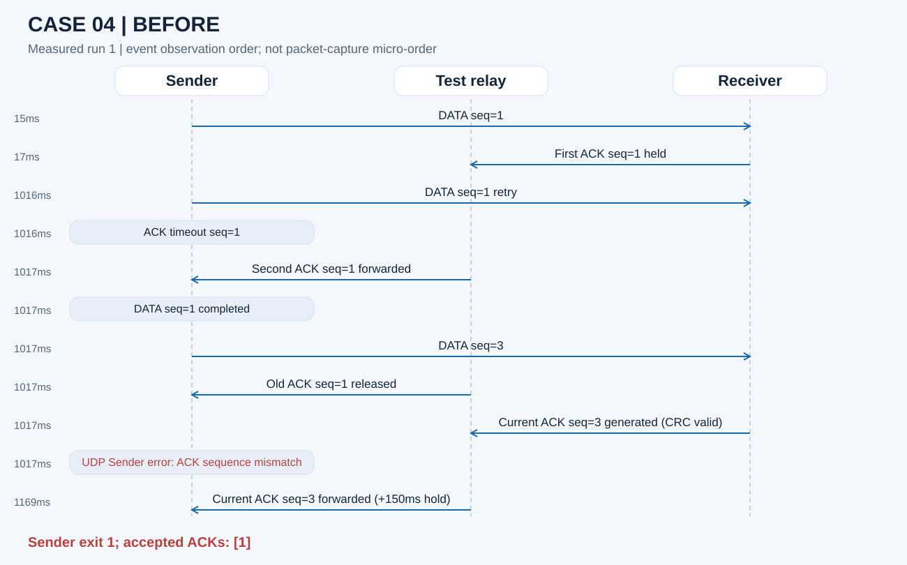

정상 생성된 과거 ACK가 현재 요청을 종료시켰다. 수정 후 completed-sequence 이력으로 stale을 분류한다. 숫자 비교만 하지 않는 이유는 기존 전송 순서가 `1 → 3 → 2`이기 때문이다. 아직 완료하지 않은 낮은 sequence도 protocol mismatch로 거부한다.

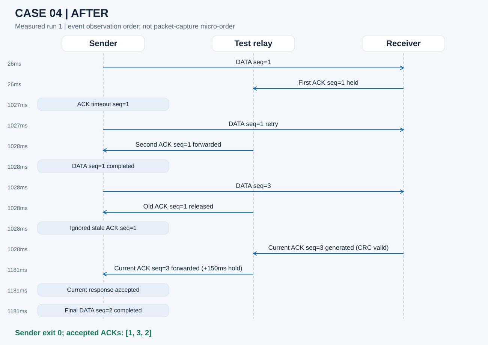
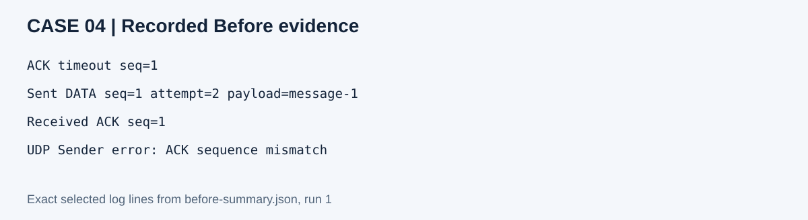

## Regression and policy checks

`regression-summary.json`: TCP none, drop-ack, delay-ack(700ms), corrupt-data, disconnect 및 UDP normal, internal-drop, order를 실제 재실행한다. 정상 DATA/ACK, Heartbeat 2/3/4, retry/duplicate, CRC rejection, reconnect를 확인한다.

`guard-summary.json`: TCP/UDP wrong type, unknown sequence, nonempty ACK, bad CRC, 반복 stale 응답의 deadline 유지, TCP partial Heartbeat ACK. UDP stale-deadline은 seq=2를 기다리며 이미 완료한 seq=3 ACK를 반복 전송하여 단순 `< expected` 구현도 검출한다.

<!-- regression-results:start -->
Measured regression: **8/8 PASS**. Additional policy guards: **11/11 PASS**.
<!-- regression-results:end -->

## Candidate 05 — Contract unclear, excluded from fixes

`candidate05-summary.json`은 기본 UDP Receiver가 실제 ACK를 전송하고 exit 0한 뒤 relay가 ACK를 버리면 Sender가 retry limit까지 실패하는 현상을 기록한다. Receiver lifecycle은 바꾸지 않았다. 지속적인 recovery service라면 문제지만 한 메시지 demo라면 실행 수명 제한이다. README/Phase 4는 이 계약을 명확히 규정하지 않아 확정 defect 수에 포함하지 않는다.

## Evidence layers and visualization

1. Reproducible: checked-in runners, real binaries, controlled fault peers.
2. Structured: case Before/After JSON, regression/guard/candidate JSON. 선택한 event와 exit를 포함하며 전체 raw stream은 임시 실행 디렉터리에 보존한다.
3. Human-readable: JSON에서 생성한 SVG, 표, case 문서. terminal screenshot은 근거로 사용하지 않았다.

```bash
python3 reliability_verification/tools/generate_visuals.py
python3 reliability_verification/tools/check_artifacts.py
```

[Image-to-source mapping](images/sources.json). CASE 03 bar 수치는 case summary에서 직접 읽는다. 로그 panel은 summary event의 실제 문자열을 추출한다. 같은 JSON으로 재생성하면 같은 SVG를 얻는다. 생성된 표를 손으로 수정하지 않는다.

## Remaining limits / observations outside this change

- README의 process-memory sequence scope, single-sender UDP, proxy blocking, no reordering buffer 제한은 유지된다.
- Deadline은 response wait 시작부터 complete response까지다. blocking connect/send의 전체 operation deadline은 추가하지 않았다.
- Partial response deadline은 안전한 fail-fast다. 자동 DATA reconnect/replay는 미구현이며 성공 복구로 표현하지 않는다.
- CASE 02는 EOF를 연결 단위로 처리한다. CRC/malformed input, 기타 socket error의 기존 fail-fast 정책을 포괄적으로 바꾸지 않았다. RST·send-side SIGPIPE 정책은 이번에 검증/수정하지 않았다.
- UDP source endpoint validation, sequence wrap/session 재사용, 인증은 이번 범위가 아니다.
- 완료 이력은 현재 유한한 demo workload를 위한 process-memory set이다. 장기 서비스의 retention 정책은 정의하지 않았다.
